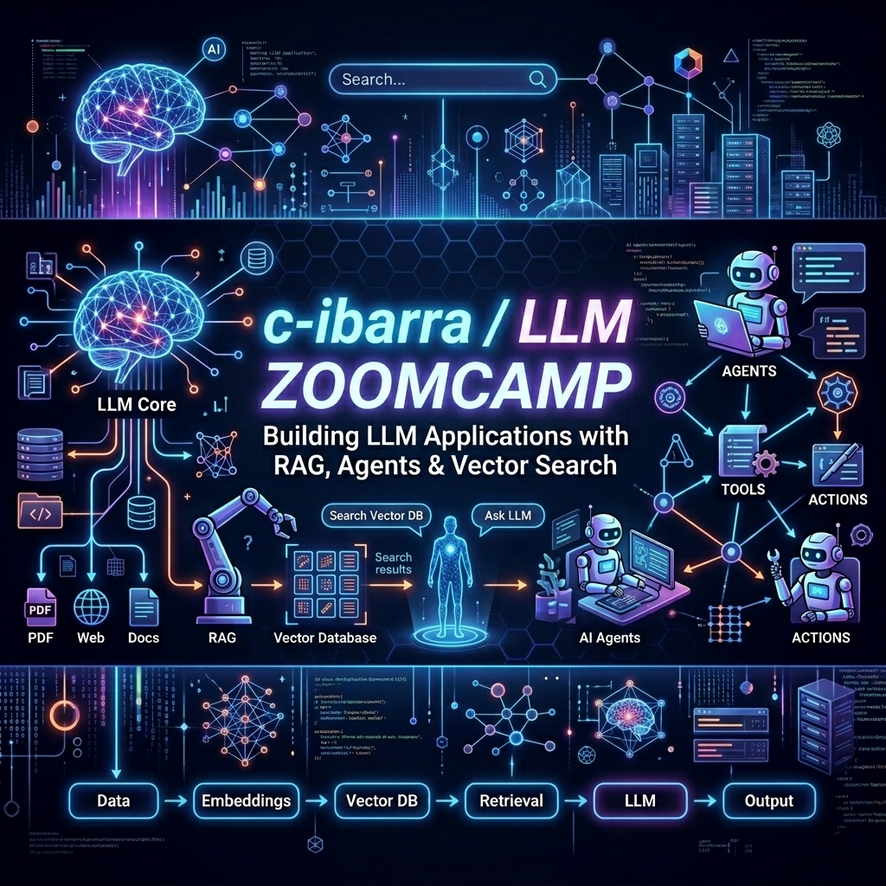

# LLM Zoomcamp 2026

<div align="center">
  
</div>


End-to-end LLM engineering course by [DataTalksClub](https://github.com/DataTalksClub/llm-zoomcamp/), covering the full stack for building production-ready RAG systems and AI agents — from retrieval and embeddings to orchestration, evaluation, and monitoring.

---

## 📖 Table of Contents
- [Project Overview](#-project-overview)
- [Modules](#-modules)
- [Tech Stack](#-tech-stack)
- [Setup](#-setup)

---

## 🎯 Project Overview

Modern LLM applications go far beyond prompting. This course tracks the engineering path from a basic RAG pipeline all the way to a production-grade system with agent orchestration, retrieval evaluation, and real-time monitoring.

Each module is delivered as a Jupyter notebook with a concrete homework, building toward a capstone project that integrates the full stack: ingestion, retrieval, generation, evaluation, and observability.

---

## 🗂 Modules

| # | Topic | Key concepts | Notebook | Status |
|---|---|---|---|---|
| 1 | **Agentic RAG** | RAG pipeline, minsearch, chunking, agentic loop with function calling | [solution.ipynb](hw1-agentic-rag/solution.ipynb) | ✅ Done |
| 2 | **Agents** | OpenAI Responses API, tool use, LangGraph, CrewAI | — | — |
| 3 | **Orchestration** | Kestra workflows, scheduling, pipeline coordination | — | — |
| 4 | **Evaluation** | Hit Rate, MRR, LLM-as-a-Judge, trajectory evaluation for agents | — | — |
| 5 | **Monitoring** | Streamlit, PostgreSQL, Grafana dashboards, Docker Compose | — | — |
| — | **Capstone** | Full RAG/agent system with ingestion, eval, UI, and monitoring | — | — |

---

## 🛠 Tech Stack

| Category | Technology | Purpose |
|---|---|---|
| **LLM** | OpenAI GPT-4o-mini | Text generation and function calling |
| **Search** | minsearch, ElasticSearch, pgvector | Keyword, full-text, and vector retrieval |
| **Agents** | toyaikit, LangGraph, CrewAI | Agentic loop and multi-agent frameworks |
| **Orchestration** | Kestra | Workflow scheduling and pipeline coordination |
| **Ingestion** | gitsource, dlt | GitHub source fetching and incremental data loading |
| **Monitoring** | Streamlit, PostgreSQL, Grafana | Chat UI, conversation storage, and dashboards |
| **Infrastructure** | Docker Compose, uv | Containerization and Python package management |

---

## 🚀 Setup

```bash
git clone https://github.com/c-ibarra/llm-zoomcamp-2026
cd llm-zoomcamp-2026
uv sync
```

### API Key

**Option 1 — 1Password (recommended):** store the key in a vault item and run `direnv allow`. The `.envrc` loads it automatically on `cd`.

**Option 2 — `.env` file:** create a `.env` file in the project root (already in `.gitignore`):

```
OPENAI_API_KEY=sk-...
```

The notebooks detect and load the key automatically from either source.

---

GitHub: [c-ibarra](https://github.com/c-ibarra)
